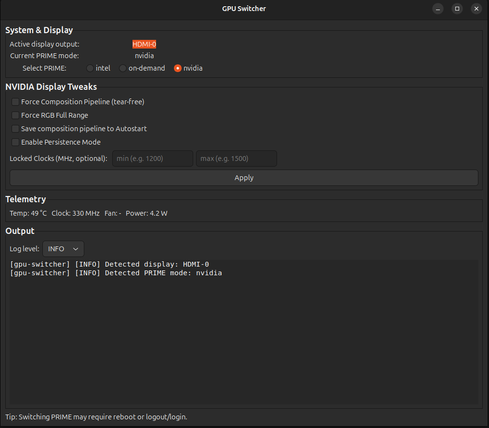
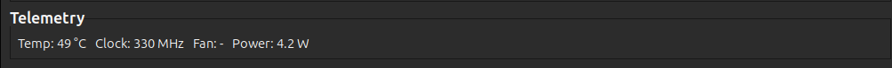

# GPU Switcher


> GUI + Bash tool to fix 4K@60 micro-stutter on NVIDIA, auto-detect displays, manage color, clocks, and autostart.

A lightweight **GUI + shell helper** to switch between **NVIDIA / Intel (PRIME)** modes, apply stutter-free composition
pipelines, manage color range, and persist settings across sessions.  
Designed for **Ubuntu 24.04 (Xorg)** — should work on most hybrid laptops (e.g., MSI GE75 Raider 9SE, RTX 2060 + UHD
630 ) with automatic output detection.

> 🧠 **TL;DR:** Fix micro-stutter on 4K@60 via `Force(Full)CompositionPipeline`, apply full-range RGB, persist at login,
> and monitor GPU telemetry live.

---

## ✨ Features

- **One-click Apply** for:
    - `ForceCompositionPipeline=On` and `ForceFullCompositionPipeline=On`
    - Full-range RGB color space
    - Optional persistence mode and fixed GPU clocks (safe min/max)
- **Auto-detects** active display output:
    - Prefers HDMI/DP/USB-C → else eDP → else first connected
- **Live telemetry (NVIDIA-only):**
    - temperature, clock, fan, power via `nvidia-smi`
- **Autostart** toggle:
    - creates `.desktop` launcher under `~/.config/autostart/`
- **Integrated log panel:**
    - every executed command and result shown in real time
- **CLI support:**
    - identical backend as GUI — useful for scripting or automation

---

## 🧩 Requirements

- **Ubuntu 24.04+** (Xorg session; *Wayland not supported yet*)
- **NVIDIA proprietary driver (550.x or newer)**
- **Intel iGPU (optional)** for PRIME mode switching
- **Tools / Dependencies**
  ```bash
  sudo apt update
  sudo apt install -y     python3-gi gir1.2-gtk-3.0 gir1.2-glib-2.0 gir1.2-notify-0.7     gir1.2-appindicator3-0.1 x11-xserver-utils edid-decode     nvidia-driver-550 nvidia-settings nvidia-utils-550 bash awk sed
  ```

> ✅ Make sure you’re using an **Xorg** session:
> ```bash
> echo $XDG_SESSION_TYPE
> ```
> Should print: `x11`

---

## ⚙️ Installation

Clone the repo and run the setup script (recommended):

```bash
git clone https://github.com/mertakkartal/gpu-switcher.git
cd gpu-switcher
chmod +x setup.sh
./setup.sh
```

This will:

- install all required dependencies (`python3-gi`, `nvidia-utils`, etc.)
- optionally create an **Autostart** entry
- make scripts executable

Alternatively, you can run manually:

```bash
chmod +x gpu-switcher-apply.sh
python3 gpu-switcher.py
```

---

## 🚀 Quick Start

### GUI

```bash
python3 gpu-switcher.py
```

- Auto-detects your active display output (`xrandr --query`)
- “Apply” sets:
    - `ForceFullCompositionPipeline=On`
    - Full RGB range (0–255)
    - (Optional) GPU persistence mode + clock limits
- “Autostart” adds launcher to:
  ```
  ~/.config/autostart/gpu-switcher.desktop
  ```

### CLI Examples

```bash
# Apply composition + color
./gpu-switcher-apply.sh --apply

# Apply + persist + autostart
sudo ./gpu-switcher-apply.sh --apply --persist --autostart on

# Set min/max GPU clocks (requires root)
sudo ./gpu-switcher-apply.sh --clk-min 1200 --clk-max 1500
```

> 🧱 **Root required** for persistence or fixed clock operations (`nvidia-smi -pm`, `-lgc`).

---

## 🔁 PRIME Switching

Switch between NVIDIA and Intel modes:

```bash
sudo prime-select nvidia   # Dedicated GPU
sudo prime-select intel    # Integrated GPU
prime-select query         # Show current mode
```

> ⚠️ Requires logout or reboot to take effect.

---

## 🧰 Autostart Configuration

Example `.desktop` entry (auto-generated):

```ini
[Desktop Entry]
Type = Application
Name = GPU Switcher Apply
Exec = /usr/bin/env bash -lc '~/.local/bin/gpu-switcher-apply.sh --apply --mode full'
X-GNOME-Autostart-enabled = true
```

File: `~/.config/autostart/gpu-switcher.desktop`  
Permissions: `chmod 644 ~/.config/autostart/gpu-switcher.desktop`

---

## 🧠 Technical Details

**Active output detection:**

```bash
xrandr --listmonitors
```

**Apply composition pipeline:**

```bash
nvidia-settings --assign "CurrentMetaMode=DP-0: 3840x2160_60 +0+0 {ForceFullCompositionPipeline=On}"
```

**Color range (full RGB):**

```bash
nvidia-settings --assign "ColorSpace=RGB"
nvidia-settings --assign "ColorRange=Full"
```

**Persistence mode + fixed clocks:**

```bash
sudo nvidia-smi -pm 1
sudo nvidia-smi -lgc 1200,1500
```

**Telemetry:**

```bash
nvidia-smi --query-gpu=temperature.gpu,clocks.sm,power.draw --format=csv
```

---

## 🧹 Reset / Revert

```bash
# Disable composition pipeline
nvidia-settings --assign "CurrentMetaMode=DP-0: 3840x2160_60 +0+0 {ForceCompositionPipeline=Off, ForceFullCompositionPipeline=Off}"

# Reset clocks
sudo nvidia-smi -rgc
sudo nvidia-smi -pm 0

# Remove autostart
rm -f ~/.config/autostart/gpu-switcher.desktop
```

---

## 🧩 Troubleshooting

| Problem                                 | Cause                                     | Fix                                 |
|-----------------------------------------|-------------------------------------------|-------------------------------------|
| GUI shows “No Xorg Display”             | Running under Wayland                     | Logout → Choose **Xorg** session    |
| “Permission denied” when setting clocks | Needs root                                | Run with `sudo`                     |
| “No active display detected”            | HDMI/DP not active                        | Wake monitor, re-run `xrandr`       |
| Settings reset after reboot             | Not autostarted                           | Enable “Autostart” in GUI           |
| VRR/G-Sync lag                          | ForceFullCompositionPipeline adds latency | Use only `ForceCompositionPipeline` |

---

## 🧩 Logs

All operations logged to both GUI panel and:

```
~/.cache/gpu-switcher/gpu-switcher.log
```

Use `--verbose` or `--dry-run` flags for detailed output.

---

## 🧪 Advanced Usage

```bash
# Dry-run (preview commands without executing)
./gpu-switcher-apply.sh --apply --dry-run

# Verbose logging
./gpu-switcher-apply.sh --apply --verbose

# Apply only for specific output
./gpu-switcher-apply.sh --output HDMI-0
```

---

## 🧰 Helper Scripts

| Script         | Description                                                            |
|----------------|------------------------------------------------------------------------|
| `setup.sh`     | Installs dependencies and optionally adds autostart entry              |
| `uninstall.sh` | Removes autostart entries and optionally resets GPU persistence/clocks |

---

## 🔒 Security Notes

- All system-level commands (`nvidia-smi`, `prime-select`) are sandboxed and validated before execution.
- No persistent background services.
- Autostart file written only to user-owned config directory.
- No external telemetry or internet access.

---

## 👤 Author

**Mert Akkartal**  
Senior Software Engineer – Java, Vue3 & Bash  
📧 [Contact via GitHub Issues](https://github.com/mertakkartal/gpu-switcher/issues)  
💻 [GitHub Profile](https://github.com/mertakkartal)

---

## 🧾 License

MIT License © 2025 Your Name  
See [LICENSE](LICENSE) for details.

---

## 📸 Screenshots

| GUI                               | Telemetry                        |
|-----------------------------------|----------------------------------|
|  |  |

---

## ❤️ Contributing

Pull requests welcome!

1. Fork the repo
2. Create a branch: `feature/improve-detection`
3. Commit & push
4. Submit a PR

---

## 🧩 Uninstall

To safely remove autostart entries and optional GPU locks:

```bash
chmod +x uninstall.sh
./uninstall.sh --gpu-reset
```

Flags:

- `--gpu-reset`: also disable persistence and reset locked clocks
- `--dry-run`: preview actions without making changes
- `--yes`: skip confirmation

---

## 🧠 Why it exists

4K@60Hz over HDMI often introduces micro-stutter due to Xorg compositor frame mismatch.  
Forcing a full composition pipeline synchronizes buffer swaps and eliminates tearing.  
This tool automates all those manual `nvidia-settings` tweaks, persists them, and ensures smooth output at login.

---

## 🧱 Credits

- NVIDIA Linux team (for `nvidia-settings`, `nvidia-smi`)
- GNOME/GTK3 for GUI bindings
- Community testers with hybrid GPUs

---

## 🧭 Roadmap

- [ ] Wayland support
- [ ] VRR / G-Sync integration
- [ ] CLI daemon for telemetry overlay
- [ ] Configurable per-display profiles
- [ ] Flatpak package distribution

---

## 🧩 Example Command Summary

| Action           | Command                                                      |
|------------------|--------------------------------------------------------------|
| Apply pipeline   | `./gpu-switcher-apply.sh --apply`                            |
| Persist mode     | `sudo ./gpu-switcher-apply.sh --persist`                     |
| Autostart on/off | `./gpu-switcher-apply.sh --autostart on/off`                 |
| Set clocks       | `sudo ./gpu-switcher-apply.sh --clk-min 1200 --clk-max 1500` |
| Reset all        | `./gpu-switcher-apply.sh --reset`                            |

---

## 🧩 Environment Variables

| Variable                    | Description                                  |
|-----------------------------|----------------------------------------------|
| `GPU_SWITCHER_VERBOSE=1`    | Enables verbose logging                      |
| `GPU_SWITCHER_FORCE_OUTPUT` | Override auto-detect display (e.g. `HDMI-0`) |

---

## 💬 Feedback

Issues & discussions:  
👉 [GitHub Issues](https://github.com/mertakkartal/gpu-switcher/issues)